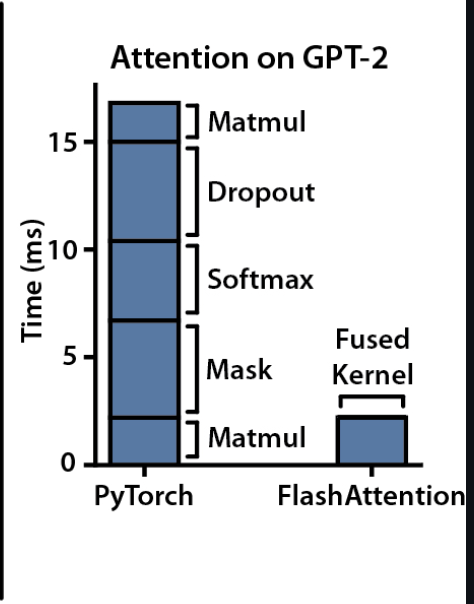

# Assignment 3 – An Optimized Attention Kernel is All You Need

# Background

### Scaled dot-product attention

The transformer's core operation can be attributed to the scaled dot-product attention. Attention lets each token in a sequence look at every other token and decide how much to borrow from it. Three matrices drive this:

Q (Query) — what this token is looking for
K (Key) — what each token has to offer
V (Value) — the actual content each token contributes

The dot product Q Kᵀ measures how well each query matches each key. Dividing by √D keeps the scores from growing too large as the head dimension D increases. Softmax turns the raw scores into weights that sum to 1. Finally, multiplying by V produces a weighted blend of token content.
Written as a formula:

```
Attention(Q, K, V) = softmax( Q Kᵀ / √D ) V
```

where **Q, K, V ∈ R^{S×D}** are the query, key, and value matrices for a single
head, **S** is the sequence length, and **D** is the head dimension.

Breaking it into the three steps an attention kernel must compute:

```
Step 1 — score matrix :   P  =  Q Kᵀ / √D       shape [S, S]
Step 2 — normalisation:   A  =  softmax(P)        shape [S, S]
Step 3 — output        :   O  =  A V              shape [S, D]
```

💡 If the matrix arithmetic feels unfamiliar, work through a small numeric example before writing any code. The AI by Hand tutorial below walks through self-attention with concrete numbers — highly recommended before you start.
[Self-Attention By Hand](https://www.byhand.ai/p/11-can-you-calculate-self-attention?utm_source=publication-search)

### The naive implementation and why it is slow

A straightforward implementation launches these three steps as **separate
kernels**. Each kernel reads its inputs from DRAM and writes its outputs back
to DRAM before the next kernel starts.

```
Q, K  ──► [ QKᵀ kernel ] ──► P (S×S, written to DRAM)
                                      │
          P ──────────────► [ softmax kernel ] ──► A (S×S, written to DRAM)
                                                          │
                  A, V ──────────────────────► [ AV kernel ] ──► O
```

The problem is the intermediate matrix **P** of shape **[S, S]**. It must be
written to DRAM by Step 1 and read back from DRAM by Step 2. Then **A** is
written and read again by Step 3. The total HBM traffic grows as **O(S²)**.

| S    | D   | Heads | S×S matrix per head | Total (8 heads, fp32) |
| ---- | --- | ----- | ------------------- | --------------------- |
| 128  | 64  | 8     | 64 KB               | 0.5 MB                |
| 512  | 64  | 8     | 1024 KB             | 8.0 MB                |
| 1024 | 64  | 8     | 4096 KB             | 32.0 MB               |
| 2048 | 64  | 8     | 16384 KB            | 128.0 MB              |

As **S** grows, most of what your kernel does is **shuffle this matrix between
compute units and DRAM**. The arithmetic intensity (FLOPs per byte transferred)
actually _decreases_ with sequence length — the kernel becomes more
memory-bound at exactly the sizes where transformers are most interesting.

---

### Flash Attention - the key insight

The current PyTorch Attention Kernel implements the Flash Attention Paper.
[Flash Attention (Dao et al., 2022)](https://arxiv.org/abs/2205.14135) makes
one observation: **you never need the full S×S matrix in memory at the same
time**. Softmax can be computed in tiles using an online update rule that
tracks the running maximum and running sum:

```
For each tile of K and V:
  1. Compute a tile of scores:  S_tile = Q Kᵀ_tile / √D
  2. Update the running max and running normaliser (online softmax)
  3. Accumulate the weighted output:  O += softmax_tile × V_tile
```

Because the tile fits in on-chip memory (SRAM on GPU / L1 cache on CPU), the
S×S matrix is **never written to DRAM**. HBM traffic drops from O(S²) to O(S),
and the kernel crosses from memory-bound to compute-bound.

You are **not** expected to implement the full Flash Attention algorithm.
However, you are strongly encouraged to think about how merging three
kernels can reduces memory traffic.

---

### Interesting Fact:

The Dot-Product Attention used for GPT2 had more than 3 kernels! But Flash-Attention solved that inefficiency.


Can you start by trying to reach similar efficiency as the attention in GPT2 ? 😊

## Your task:

1. Start by implementing the scaled dot product attention inside `_CUDA_SRC` (GPU) or `_CPP_SRC` (CPU). We recommend starting simple and then slowly optimizing your solution.
2. Run the correctness check to verify your output matches PyTorch.
3. Code the performance benchmark to compare and measure your speedup.
4. Profile with Nsight Compute (or other tools).
5. Include the roofline evidence in your report.

## Submission checklist

```
[ ] Correctness check passes for all three configurations (max_err < 1e-3)
[ ] Benchmark table: your kernel vs F.scaled_dot_product_attention
    across at least three sequence lengths (S = 128, 512, 1024)
[ ] Profiler evidence (before and after optimization):
      GPU — Nsight Compute screenshot of Speed of Light panel
      CPU — Intel Advisor roofline screenshot or HTML report
[ ] Written report covering the four sections below
```

---

## Report requirements

### 1. Arithmetic intensity derivation

Derive the arithmetic intensity (AI = FLOPs / Bytes) for your
implementation. Show your working:

```
FLOPs  = ...
Bytes  = ...         (account for every read and write of each tensor)
AI     = FLOPs / Bytes = X FLOP/byte
```

Then compute AI for at least two sequence lengths (e.g. S = 128 and S = 1024)
and state whether AI increases or decreases as S grows, and what this implies.

---

### 2. Profiler evidence

**GPU — Nsight Compute (Speed of Light panel)**

Include a screenshot showing, for each of your kernels:

- **Memory Throughput %** — percentage of peak HBM bandwidth used
- **Compute (SM) Throughput %** — percentage of peak FLOP rate used
  The kernel with Memory% >> Compute% is memory-bound. The one with
  Compute% >> Memory% is compute-bound. State which is which.

Also include a screenshot of the **Roofline tab**, showing where your kernel
dots sit relative to the ridge point.

**CPU — Intel Advisor (Roofline tab)**

Include a screenshot of the roofline chart. Each loop in your C++ code appears
as a labelled dot. Note which dots fall in the memory-bound region (left of the
ridge) and which fall in the compute-bound region (right of the ridge). If any
dots fall well below the nearest roofline, include the vectorisation advice
Intel Advisor provides and explain what it means.

---

### 3. Written analysis

Address all of the following in your report:

- **Memory-bound or compute-bound?**  
  For each of your three kernels (or your fused kernel), state which it is and
  justify your answer using the profiler numbers and your AI calculation.
- **Performance gap**  
  How much slower is your implementation than
  `F.scaled_dot_product_attention`? Report the slowdown factor for each
  sequence length. What optimisations does PyTorch apply that your
  implementation does not?
- **Effect of sequence length**  
  How does AI change as S increases for the naive implementation? What does
  this tell you about how the bottleneck changes with sequence length, and why
  does this matter for long-context language models?
- **Impact of kernel fusion** _(if you attempted Step 3)_  
  Compare the profiler output before and after merging kernels. Does DRAM%
  decrease? Does your position on the roofline move to the right? By how much
  did the execution time change?

## References

- Vaswani et al., _Attention Is All You Need_, NeurIPS 2017.  
  https://arxiv.org/abs/1706.03762
- Milakov & Gimelshein, _Online normalizer calculation for softmax_, 2018.  
  https://arxiv.org/abs/1805.02867
- Dao et al., _FlashAttention: Fast and Memory-Efficient Exact Attention with IO-Awareness_, NeurIPS 2022.  
  https://arxiv.org/abs/2205.14135
- NVIDIA Nsight Compute documentation.  
  https://docs.nvidia.com/nsight-compute/
- Intel Advisor Roofline Analysis documentation.  
  https://www.intel.com/content/www/us/en/docs/advisor/user-guide/current/roofline.html
